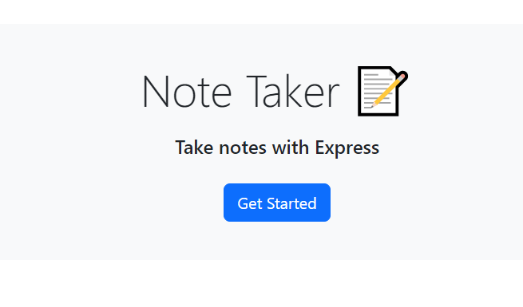

# The Perfect Note Taker
This is a applaction that you can add and save notes. This is done using the Express and Node.js. Use it to stay organized and keep track of important information.


## Installation

You need to npm i before anything works.

## Deployment

To deploy this project:

```bash
npm start
```

Than you go to : http://localhost:3001


## Contributing

Pull requests are welcome. For major changes, please open an issue first
to discuss what you would like to change.


## License

[MIT](https://choosealicense.com/licenses/mit/)